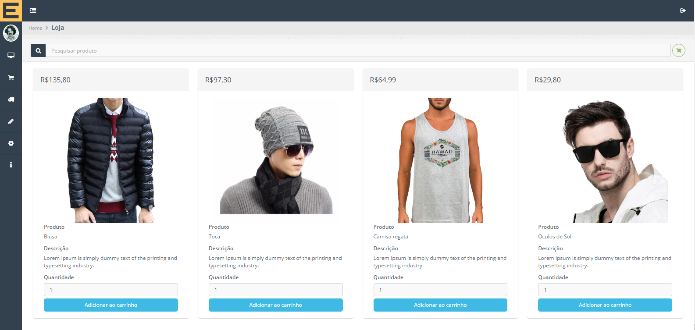

# 4. Ecommerce

Projeto desenvolvido em  [PHP] version 7.3.4 [mysql] version 5.7
 

Cenários:[Cadastro de produtos/ Consulta de produtos/ Adição de produtos ao carrinho de compras/ Edição do carrinho de compras/ Gerar pedido/ Cancelar pedido]

## Imagem da Loja

## Imagem Carrinho de compras

## Imagem Cadastro de Produtos

## Script SQL

Para construção do banco executar script SQL contido no diretório(dev-data/scriptSQL_START.sql)

## Edição de configuração de acesso a Base de Dados

Todas as configurações necessárias de acesso a base de dados estão armazenadas no arquivo parâmetros.php
 

    if ($tipo_conexao == "base") {
          $host = "localhost";
          $database = "tst_ecommerce";
          $user= "root";
          $pass="";
          return  mysqli_connect($host, $user,$pass,$database);
      }

## Execução em ambiente servidor

Para execução mova o projeto para o diretório do seu servidor local ex: APACHE(htdocs)
